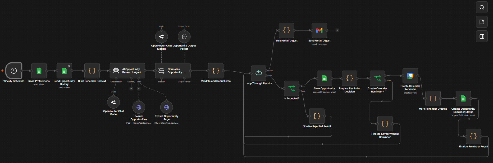
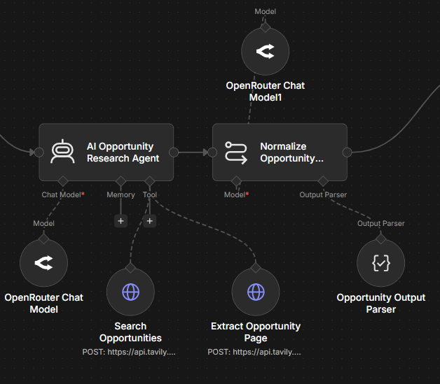
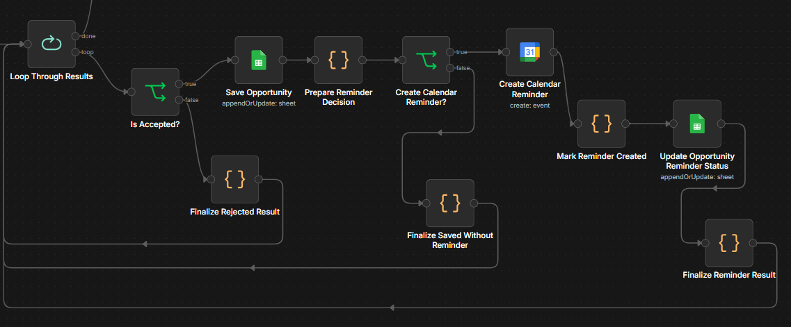
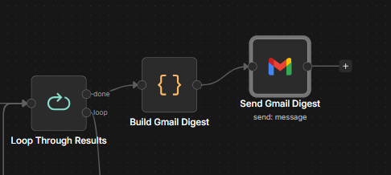

# 🤖 AI Opportunity Radar

AI Opportunity Radar is a single n8n workflow that discovers, verifies, scores, deduplicates, stores, and reports relevant AI opportunities.

It searches for opportunities such as:

- Hackathons
- Conferences
- Fellowships
- Competitions
- Research programs
- Internships

## ⚙️ What the Workflow Does

1. Reads user preferences from Google Sheets.
2. Searches for relevant opportunities using Tavily.
3. Uses an AI agent to select promising official pages.
4. Extracts and verifies opportunity details.
5. Normalizes the research output into a fixed schema.
6. Validates location, type, score, deadline, and source URL.
7. Rejects duplicates and previously saved opportunities.
8. Saves accepted opportunities to Google Sheets.
9. Creates Google Calendar reminders when a reliable deadline exists.
10. Builds and sends a Gmail digest.
11. Runs automatically on a weekly schedule.

## 🏗️ Workflow Architecture

## 🛠️ Main Technologies

- n8n
- OpenRouter
- Tavily Search and Extract
- Google Sheets
- Google Calendar
- Gmail
- JavaScript Code nodes
- Structured Output Parser

## ✨ Key Features

- Official-source verification
- Search and extraction using AI tools
- Deterministic validation after AI processing
- Relevance scoring
- Location and opportunity-type filtering
- Deadline confidence handling
- Duplicate detection by URL and title/organizer
- Calendar reminders for verified deadlines
- HTML email digest
- Weekly scheduled execution
- Single-workflow architecture

## 📅 Deadline Handling

The workflow does not invent deadlines.

When an official source does not provide a reliable application, registration, or submission deadline:

- The opportunity may still be saved.
- The deadline remains `null`.
- No Calendar reminder is created.
- The email digest explains that the deadline was not verified.

## 🖼️ Screenshots

### 🔍 Research and Validation

### 📊 Calendar, Storage, and Email Flow

### 📧 Gmail Digest

## 📥 Importing the Workflow

1. Download `Workflows/AI Opportunity Radar.json`.
2. Open n8n.
3. Create a new workflow.
4. Import the downloaded JSON file.
5. Configure your own credentials for:
   - Google Sheets
   - Google Calendar
   - Gmail
   - Tavily
   - OpenRouter
6. Create the required Google Sheets tabs and update the node settings.
7. Test manually before activating the Schedule Trigger.

## 🔐 Security

Credentials and personal account data are not included.

Anyone importing this workflow must configure their own credentials and resource IDs.

## ✅ Status

Completed and tested with:

- Accepted opportunity handling
- Rejected opportunity handling
- Duplicate detection
- Missing-deadline handling
- Google Sheets storage
- Google Calendar reminder logic
- Gmail digest generation
- Weekly scheduling

## 📄 License

Copyright © 2026 Jawaria Tariq. All rights reserved.
